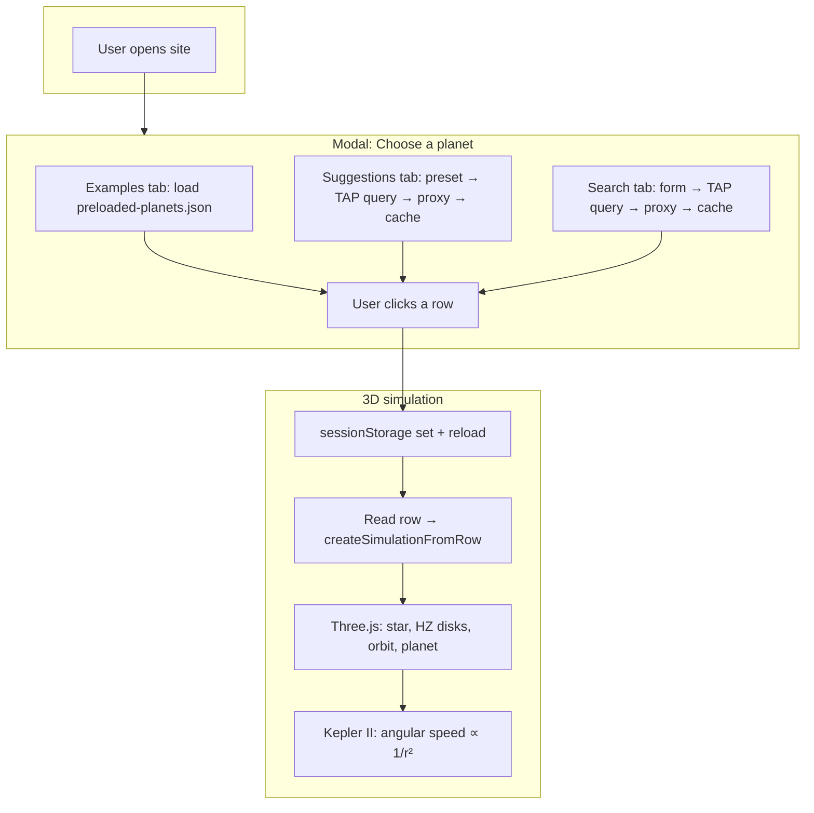

# Goldilocks Sim — System Design (GitHub Pages)

Static site; data either from a **preloaded JSON** file or from the **NASA Exoplanet Archive** via the browser. No backend.

## How you pick a planet (three paths)

| Tab | Data source | When |
|-----|-------------|------|
| **Examples** | `preloaded-planets.json` (static file in repo) | Fetched once when the tab is shown; list is solar system + a few exoplanets. No API, no CORS. |
| **Suggestions** | NASA Exoplanet Archive TAP | User clicks a preset (Famous, Highly elliptical, Hot Jupiters, Earth-sized); we build a TAP query and fetch via a **CORS proxy** (all origins). Results **cached in memory** per request key. |
| **Search** | NASA Exoplanet Archive TAP | User submits the filter form; we build a TAP query and fetch via the same CORS proxy; results cached. |

NASA TAP does not allow arbitrary cross-origin requests, so we send all archive requests through a proxy (e.g. `api.allorigins.win/raw?url=...`). That allows the app to work when deployed (e.g. GitHub Pages, custom domain).

After picking a planet (any tab), we store the row in `sessionStorage` and reload; the sim page reads it and runs the 3D scene.

## High-level flow

## Data flow (no backend)

| Step | Where | What |
|------|--------|------|
| 1 | Modal (Examples) | Fetch `preloaded-planets.json`; render list. Same row shape as TAP. |
| 2 | Modal (Suggestions / Search) | Build ADQL and TAP URL; `fetch(CORS_PROXY + TAP_URL)`; parse JSON; cache on success; render list. |
| 3 | User | Clicks one result (from any tab). |
| 4 | JS | `sessionStorage.setItem("goldilocks_planet", JSON.stringify(row))`; reload. |
| 5 | Sim page | Read row from sessionStorage; `createSimulationFromRow(row)` → state (orbit, HZ, star, etc.). Semi-major axis derived from period when catalog value missing or inconsistent (Kepler III). |
| 6 | Sim page | Three.js: star (color from Teff), three HZ disks (red / green / blue), elliptical orbit (Kepler II: speed ∝ 1/r²), planet. |

Everything runs in the browser; only static files, one optional JSON fetch, and (for Suggestions/Search) proxied TAP requests.
