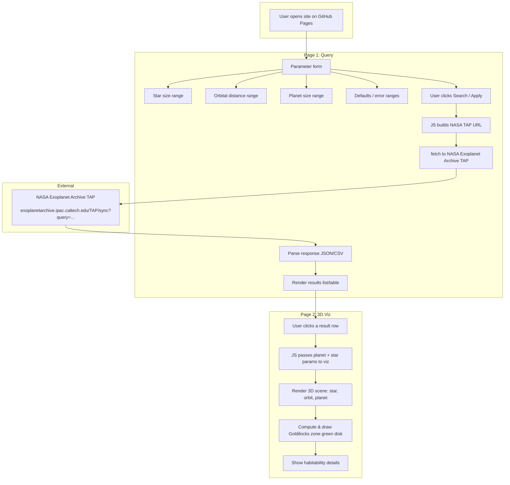

# Goldilocks Sim — System Design (GitHub Pages)

Static site; all data fetched from the browser. No backend.

## Data flow (no backend)

| Step | Where | What |
|------|--------|------|
| 1 | Page 1 (JS) | Read form values (ranges for star size, orbital distance, planet size, etc.). |
| 2 | Page 1 (JS) | Build ADQL query and TAP URL (e.g. `SELECT ... FROM ps WHERE ... &format=json`). |
| 3 | Browser | `fetch(TAP_URL)` → NASA TAP (CORS permitting). |
| 4 | Page 1 (JS) | Parse response → display rows. |
| 5 | User | Clicks one result. |
| 6 | Page 2 (JS) | Receive planet/star params (via route state, hash, or sessionStorage). |
| 7 | Page 2 (JS) | Three.js (or similar): draw star, orbit from `pl_orbsmax`/ecc, planet from `pl_rade`. |
| 8 | Page 2 (JS) | Compute HZ from stellar lum/Teff; draw green disk; show “in Goldilocks” yes/no. |

Everything runs in the browser; no server or “piping” — only static files + JS calling NASA TAP.
