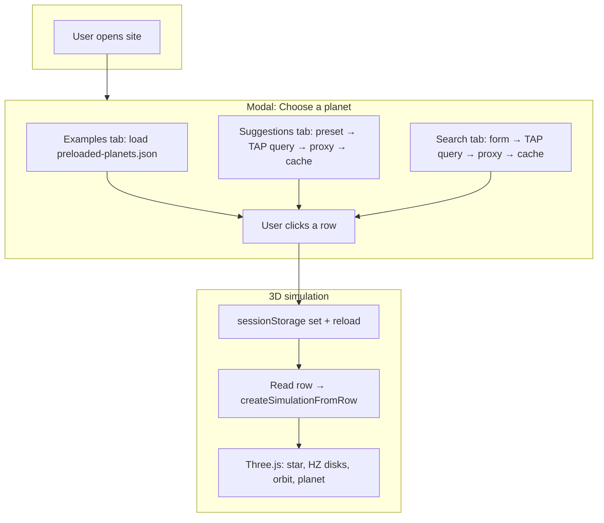

# Goldilocks Sim — System Design (GitHub Pages)

Static site; data either from a **preloaded JSON** file or from the **NASA Exoplanet Archive** via the browser. No backend.

## How you pick a planet (three paths)

| Tab | Data source | When |
|-----|-------------|------|
| **Examples** | `preloaded-planets.json` (static file in repo) | Fetched once when the tab is shown; list is solar system + a few exoplanets. No API, no CORS. |
| **Suggestions** | NASA Exoplanet Archive TAP | User clicks a preset (Famous, Highly elliptical, Hot Jupiters, Earth-sized); we build a TAP query and fetch via a **CORS proxy** (all origins). Results **cached in memory** per request key. |
| **Search** | NASA Exoplanet Archive TAP | User submits the filter form; we build a TAP query and fetch via the same CORS proxy; results cached. |

NASA TAP does not allow arbitrary cross-origin requests, so we send all archive requests through a proxy (e.g. `api.allorigins.win/raw?url=...`). That allows the app to work when deployed (e.g. GitHub Pages, custom domain).

After picking a planet (any tab), we store the row in `sessionStorage` and reload; the sim page reads it and runs the 3D scene.

## High-level flow

```mermaid
flowchart TB
    subgraph USER[" "]
        A[User opens site]
    end

    subgraph MODAL["Modal: Choose a planet"]
        EX[Examples tab: load preloaded-planets.json]
        SUG[Suggestions tab: preset → TAP query → proxy → cache]
        SRCH[Search tab: form → TAP query → proxy → cache]
        CLICK[User clicks a row]
    end

    subgraph VIZ["3D simulation"]
        STORE[sessionStorage set + reload]
        RENDER[Read row → createSimulationFromRow]
        SCENE[Three.js: star, HZ disks, orbit, planet]
    end

    A --> MODAL
    EX --> CLICK
    SUG --> CLICK
    SRCH --> CLICK
    CLICK --> STORE
    STORE --> RENDER
    RENDER --> SCENE
```

## Data flow (no backend)

| Step | Where | What |
|------|--------|------|
| 1 | Modal (Examples) | Fetch `preloaded-planets.json`; render list. Same row shape as TAP. |
| 2 | Modal (Suggestions / Search) | Build ADQL and TAP URL; `fetch(CORS_PROXY + TAP_URL)`; parse JSON; cache on success; render list. |
| 3 | User | Clicks one result (from any tab). |
| 4 | JS | `sessionStorage.setItem("goldilocks_planet", JSON.stringify(row))`; reload. |
| 5 | Sim page | Read row from sessionStorage; `createSimulationFromRow(row)` → state. All derived values (orbital distance, luminosity, Goldilocks zone) come from computations and fallbacks below. |
| 6 | Sim page | Three.js: star (color from Teff), three HZ disks, elliptical orbit, planet. Orbit animation uses equal-areas-in-equal-times (Kepler II). |

Everything runs in the browser; only static files, one optional JSON fetch, and (for Suggestions/Search) proxied TAP requests.

## Computation and fallbacks

These happen inside `createSimulationFromRow` (and the scene uses the resulting state). They are not separate user-facing steps.

### Orbital distance (semi-major axis, AU)

- **Primary:** Catalog value `pl_orbsmax` when present and **consistent** with period and star mass (within 0.5×–2× of the Kepler III value).
- **Fallback:** From orbital period and star mass via **Kepler III**: \(a_{\mathrm{AU}}^3 = T_{\mathrm{yr}}^2 \cdot M_\odot\). Used when the catalog value is missing or outside that range (e.g. archive placeholder 1.0).

### Stellar luminosity (for Goldilocks zone and display)

- **Primary:** \(L/L_\odot = 10^{\mathtt{st\_lum}}\) when `st_lum` (log₁₀ luminosity) is present in the row.
- **Fallback:** Derived from radius and effective temperature when `st_lum` is missing or invalid: \(L/L_\odot = (R/R_\odot)^2 \cdot (T/T_\odot)^4\) with \(T_\odot = 5778\,\mathrm{K}\). Ensures red dwarfs (e.g. K2-18) get a correct HZ instead of defaulting to solar luminosity.
- **Last resort:** \(L = 1\) (solar) if neither source is usable.

### Goldilocks zone (habitable zone, AU)

- **Formula:** Flux \(\propto L/d^2\) ⇒ distance \(\propto \sqrt{L}\). Inner and outer bounds use the **resolved luminosity** (above):
  - Inner: \(0.75 \sqrt{L}\)
  - Outer: \(1.77 \sqrt{L}\)
- **In/out check:** Planet semi-major axis vs these bounds → “in”, “too close”, or “too far”. No climate or atmosphere model; luminosity-only.

### Orbit animation

- **Kepler II:** Equal areas in equal times → angular speed \(\propto 1/r^2\) (with current \(r\) and eccentricity). Elliptical orbit is drawn from precomputed points; the planet position is advanced using this relation so it speeds up near the star.

### Scale and reference in the scene

- **Units:** 1 scene unit = 1 AU everywhere.
- **1 AU reference:** A dashed gray circle at radius 1 AU in the same plane as the orbit and HZ disks (XZ). The disclaimer notes that this circle marks 1 AU from the star.
